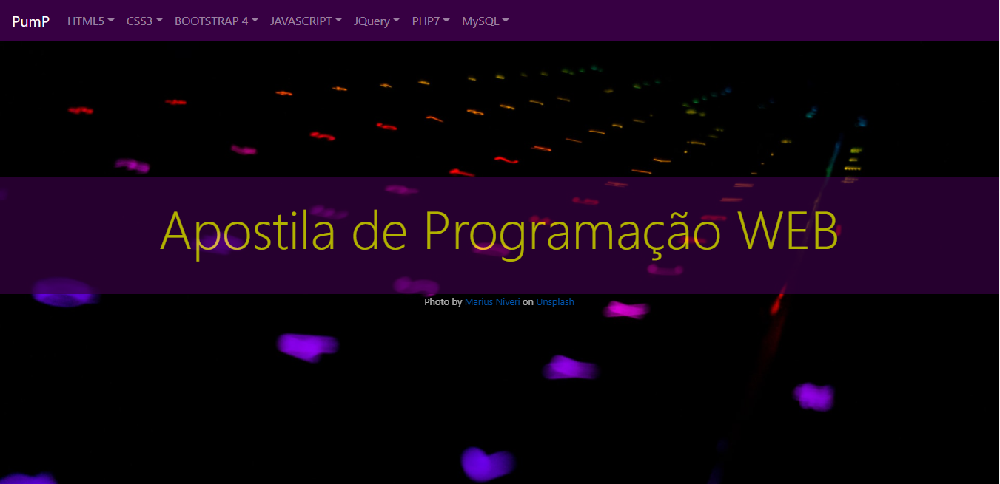
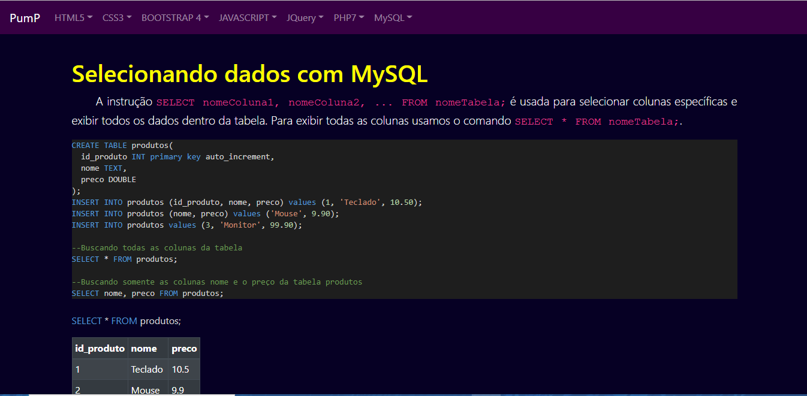

# Apostila - WEB

Este trabalho teve como objetivo criar uma apostila de estudos pessoais, onde a teoria e a prática pudessem ser executados em conjunto. Esta apostila foi criado através de um compilado entre os cursos online da plataforma Udemy, das disciplinas cursadas durante a graduação de Ciência da Computação na Universidade Federal de Viçosa e vários tutoriais online, como a w3cschool. 




## 💻 Páginas 

Exemplo de um dos tutoriais. 




********************************************


## 🚀 Começando

Para obter uma cópia deste projeto:

```shell
git clone https://github.com/adrianomqsmts/apostila-web-basica
cd apostila-web-basica
```
## 🛠️ Construído com

Ferramentas, linguagens e outras tecnologias usadas no desenvolvimento deste sistema.

* [Visual Studio Code](https://code.visualstudio.com/docs) - Ambiente de Desenvolvimento
* [Git](https://git-scm.com/) - Controle de Versões
* [Bootstrap 4](https://getbootstrap.com/docs/4.0/getting-started/introduction/) - Framework
* [JavaScript](https://developer.mozilla.org/pt-BR/docs/Web/JavaScript) - Linguagem
* ...

## ✒️ Autores

* **Desenvolvedor** - *Código e Documentação* - [Adriano](https://github.com/adrianomqsmts)

